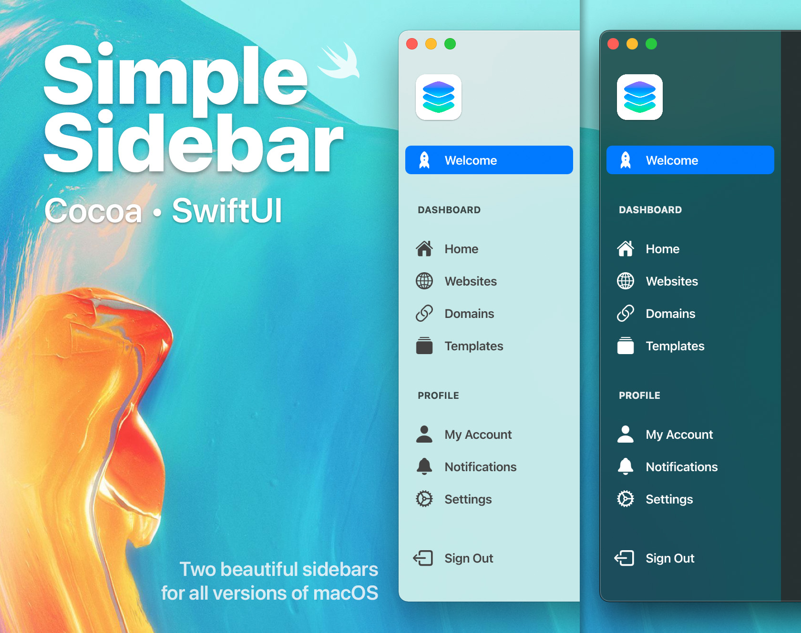

The SwiftUI sidebar implementation is courtesy of [1998code](https://github.com/1998code/SwiftUI2-MacSidebar). Go show them some love!

# SimpleSidebar
Two implementations of the macOS sidebar:

- **Cocoa** (OS X 10.10 and later)
- **SwiftUI** (macOS 11 and later)

As much as I love SwiftUI, this project is more of a PoC that Cocoa is still relevant. I wanted to show that a Cocoa implementation of something as simple as a sidebar didn't need to be extremely complex and time-consuming.

I do intend on making a Swift package with zero external assets required – aside from the menu icons – and would love some help getting started!

Although SwiftUI has made it a breeze to implement, I've always found the process to be far more complex than it needs to be when working with Cocoa.

Since I'm constantly developing newer applications with SwiftUI – yet also maintaining older projects that require maximum OS compatibility – I thought it would be useful to have a resource that portrays both implementations.

