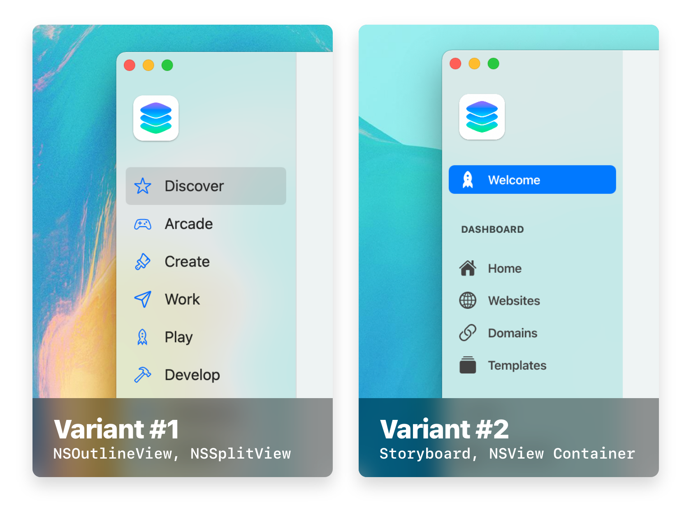
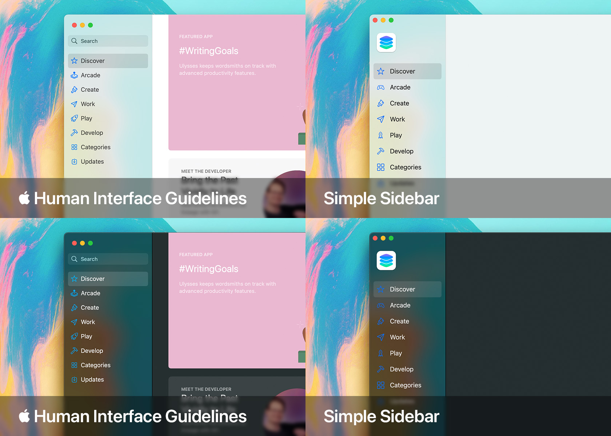

The SwiftUI sidebar implementation—used for comparison purposes—is courtesy of [1998code](https://github.com/1998code/SwiftUI2-MacSidebar). Go show them some love!

# Overview
Provided in this project are three different implementations of the macOS sidebar:

<table><tr>
  <th>Variant</th>
  <th>Compatibility</th>
</tr>
<tr><td>
  
**Cocoa**

- **Variant 1:** Built for Programmers `(NSOutlineView)`
- **Variant 2:** Built for Designers `(Storyboards)`
        
</td><td>

OS X 10.11 and higher

</td></tr>
<tr><td>

**SwiftUI**

- **Joint Variance:** `SideBarListStyle()`

</td><td>

macOS 11.0 and higher

</td></tr></table>



As much as I love SwiftUI, this project is more of a POC that Cocoa is still relevant. I wanted to show that the Cocoa implementation of something as simple as a sidebar didn't need to be extremely complex or time-consuming. Similarily, creating a highly-customizable sidebar shouldn't require heavily packaged frameworks.

# Variant 1 <sup>Cocoa</sup>

The variant that was built with the average programmer in-mind.



<table><tr>
  <th>Pros</th>
  <th>Cons</th>
</tr>
<tr><td>
  
```
• Fastest Cocoa implementation
• Easy to setup and configure menu items
• Resizable sidebar (NSSplitView)
• Adopts the style of the user's current
  version of macOS (tbt to aqua!)
• Only assets are icons (optional)
```
        
</td><td>

```
• Lacks section & row headers
• Not very customizable
• Menu items are inherited
• All follow the same structure
  ie. title & icon
```

</td></tr></table>

### Summary
Great for implementing basic sidebars that don't need a ton of customization. Adopts the style of the user's version of macOS for complete immersion with backward-compatibility.

# Variant 2 <sup>Cocoa</sup>

The variant that was built for designers who love Storyboards.


<table><tr>
  <th>Pros</th>
  <th>Cons</th>
</tr>
<tr><td>
  
```
• Highly customizable interface
• Allows for individual menu item customization 
• Same appearance across all versions of macOS
• Mutable/customizable container view
• Easy to modify, manipulate and animate
  ie. Toggle hide/show sidebar with fade effect
```
        
</td><td>

```
• Heavily relies on Storyboards
• Uses AutoLayout + Constraints
• Experience with design software – ie.
  Photoshop/XD – for the ultimate
  customization experience
```

</td></tr></table>

### Summary
Great for maximum customization. Maintains the same style and appearance, regardless of the user's macOS version (bring newer UI design standards to backwards compatible applications)!


----

## MIT License
> Copyright 2021 © Justin Bush
> 
> Permission is hereby granted, free of charge, to any person obtaining a copy of this software and associated documentation files (the "Software"), to deal in the Software without restriction, including without limitation the rights to use, copy, modify, merge, publish, distribute, sublicense, and/or sell copies of the Software, and to permit persons to whom the Software is furnished to do so, subject to the following conditions:
> 
> The above copyright notice and this permission notice shall be included in all copies or substantial portions of the Software.
> 
> THE SOFTWARE IS PROVIDED "AS IS", WITHOUT WARRANTY OF ANY KIND, EXPRESS OR IMPLIED, INCLUDING BUT NOT LIMITED TO THE WARRANTIES OF MERCHANTABILITY, FITNESS FOR A PARTICULAR PURPOSE AND NONINFRINGEMENT. IN NO EVENT SHALL THE AUTHORS OR COPYRIGHT HOLDERS BE LIABLE FOR ANY CLAIM, DAMAGES OR OTHER LIABILITY, WHETHER IN AN ACTION OF CONTRACT, TORT OR OTHERWISE, ARISING FROM, OUT OF OR IN CONNECTION WITH THE SOFTWARE OR THE USE OR OTHER DEALINGS IN THE SOFTWARE.
